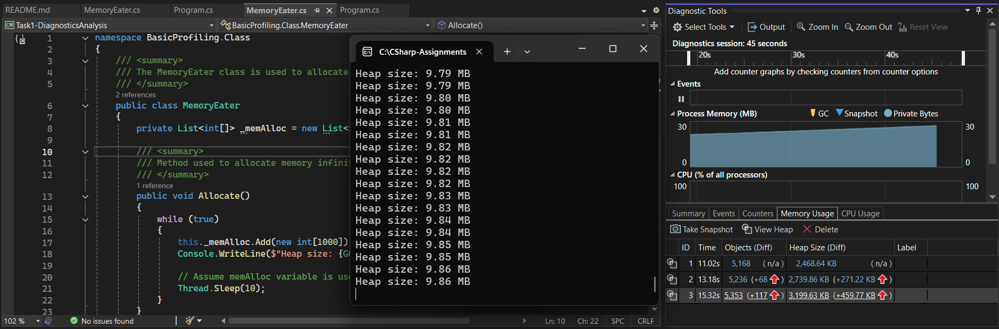
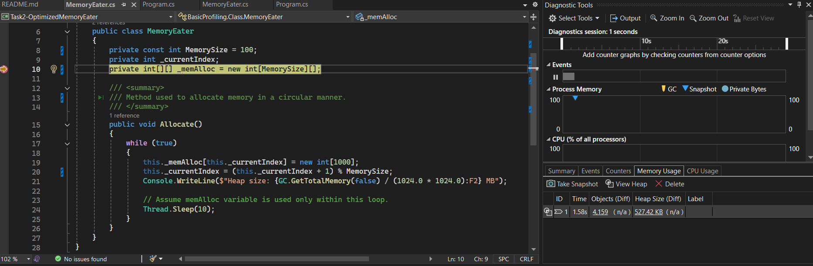
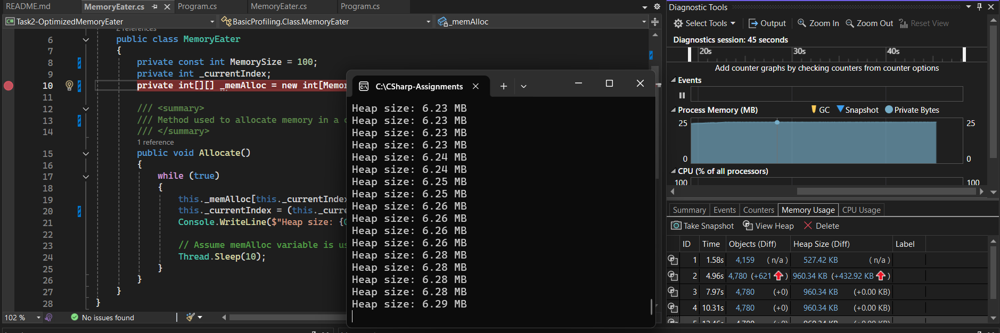

# Assignment 12 - Memory Management - Basic Profiling

## Introduction
 
This assignment focuses on understanding memory management in .NET through the identification, analysis, and optimization of memory-related issues. Using memory profiling techniques and diagnostic tools, the assignment explores how object allocation, reference retention, and garbage collection impact an application's memory usage.

---

# Task 1 – Detecting and Diagnosing Memory Issues

This task demonstrates how memory leaks can occur in managed applications when objects remain reachable and cannot be reclaimed by the Garbage Collector. The goal is to identify the memory issue in the provided code and analyze its impact using memory profiling tools.

## Concepts Covered

- Managed Heap
- Garbage Collection (GC)
- Object Reachability
- Memory Leaks
- Memory Profiling

## Problem Analysis

The application continuously allocates memory inside an infinite loop.
```csharp
while (true)
{
    this._memAlloc.Add(new int[1000]);
    Console.WriteLine($"Heap size: {GC.GetTotalMemory(false) / (1024.0 * 1024.0):F2} MB");

    Thread.Sleep(10);
}
```

Each iteration creates a new integer array and stores it in the _memAlloc collection.
Since the list is a field of the MemoryEater object, every allocated array remains referenced for the lifetime of the object.

As a result:

- New memory is allocated continuously.
- Previously allocated arrays remain reachable.
- The Garbage Collector cannot reclaim the allocated arrays.
- Heap memory usage grows indefinitely.
- The application eventually consumes excessive memory and may terminate with an OutOfMemoryException.

## Root Cause

The primary issue is not that memory is being allocated, but that it is never released.
Because the arrays are referenced by _memAlloc, they remain reachable from the application's object graph.
```text
MemoryEater Object
        │
        ▼
    _memAlloc List
        │
        ▼
     int[1000], int[1000], int[1000], ...
```

The Garbage Collector only reclaims objects that are no longer reachable. Since every allocated array is still referenced by the list, none of them become eligible for garbage collection.

## Memory Profiling Analysis

The application was analyzed using Visual Studio Diagnostic Tools.

- Heap memory increased continuously during execution.
- The number of int[] instances grew with each iteration.
- Garbage Collection cycles occurred periodically.



---

# Task 2 – Implementing Memory Management Best Practices

This task focuses on resolving the memory retention issue identified in Task 1 and applying memory management best practices to achieve more predictable and efficient memory usage.

## Concepts Covered

- Garbage Collection (GC)
- Heap Memory Management
- Circular Buffer
- Allocation Optimization
- Memory Profiling

## Key Observation

- The original implementation continuously retained references to newly allocated arrays, causing heap memory usage to increase indefinitely.
- The optimized implementation stores only a fixed number of arrays and reuses existing storage locations.
- Older array references are automatically replaced, allowing previously allocated arrays to become eligible for garbage collection.
- Heap memory usage stabilizes instead of growing continuously.
- The application can run for extended periods without excessive memory consumption.

## Optimization Analysis

### Original Implementation

The original implementation used a dynamically growing collection. New arrays were continuously added to the collection.

```csharp
private List<int[]> _memAlloc = new List<int[]>();
_memAlloc.Add(new int[1000]);
```

Since every allocated array remained referenced by the list, the Garbage Collector could not reclaim any of them. As execution continued, memory usage increased without any upper limit.

### Optimized Implementation

The optimized implementation replaces the dynamically growing collection with a fixed-size array.

```csharp
private const int MemorySize = 100;
private int[][] _memAlloc = new int[MemorySize][];
```

A circular indexing mechanism is used to overwrite older entries.

```csharp
this._memAlloc[this._currentIndex] = new int[1000];
this._currentIndex = (this._currentIndex + 1) % MemorySize;
```

When a reference is overwritten, the previously stored array becomes unreachable. Since no references remain to that object, it becomes eligible for garbage collection.
As a result, memory can be reclaimed naturally by the CLR without requiring explicit calls to GC.Collect().

---

# Task 3 – Memory Profiling

This task demonstrates how memory profiling tools can be used to analyze application memory usage and validate optimization efforts. The goal is to compare the memory behavior of the original implementation and the optimized implementation and understand how proper memory management affects heap usage.

## Concepts Covered

- Memory Profiling
- Heap Analysis
- Diagnostic Tools
- Performance Monitoring

## Key Observation

- Memory profiling provides visibility into how objects are allocated and retained in memory.
- The original implementation showed continuous heap growth because allocated arrays remained referenced indefinitely.
- The optimized implementation maintained a relatively stable memory footprint by limiting the number of retained references.
- Profiling confirms whether memory optimizations are actually effective rather than relying solely on code inspection.

## Memory Profiling Analysis

### Before Optimization

The original implementation continuously added newly allocated arrays to a growing collection.

Profile observations:

- Heap memory continuously increased during execution.
- The number of int[] instances kept growing.


### After Optimization

The optimized implementation uses a fixed-size circular buffer.

Profile observations:

- Heap memory increased initially while the buffer was being populated.
- Memory growth stabilized once the buffer reached its fixed capacity.
- Older arrays became eligible for garbage collection when their references were overwritten.
- Overall memory usage became predictable and significantly more efficient.




## Comparison

### Before Optimization

- Continuously increasing heap usage.
- Memory usage increased for the entire lifetime of the application.

### After Optimization

- Fixed-size memory allocation strategy.
- Stable heap usage after initialization.

## Other Profiling Tools Explored

In addition to Visual Studio Diagnostic Tools, I explored some popular memory profiling tools commonly used in professional .NET development:

- JetBrains dot Memory Profiler
- ANTS Memory Profiler

I explored them and found out that they are paid platforms and I didn't try the trial version as well :(. So I just used Visual Studio's Diagnostic Tool.

---

# How to Run the Applications

## Prerequisites

- .NET 6 SDK or later
- Visual Studio 2022 or Visual Studio Code

## Steps

1. Clone or download the project.
2. Open the solution in Visual Studio.
3. This solution consists of three different projects.
4. Build the solution and set one of the projects as the startup project.
5. Run the project.

---
